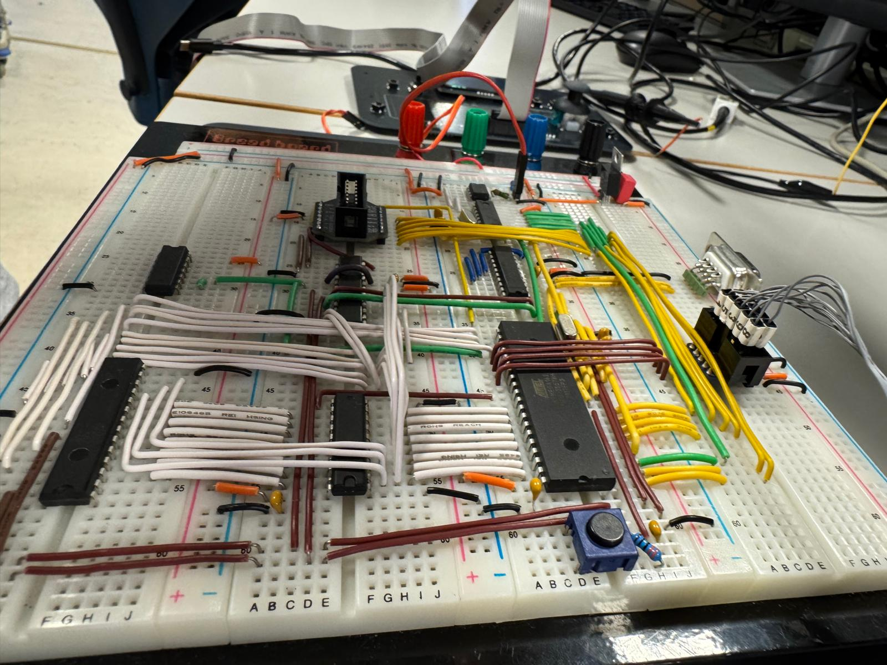
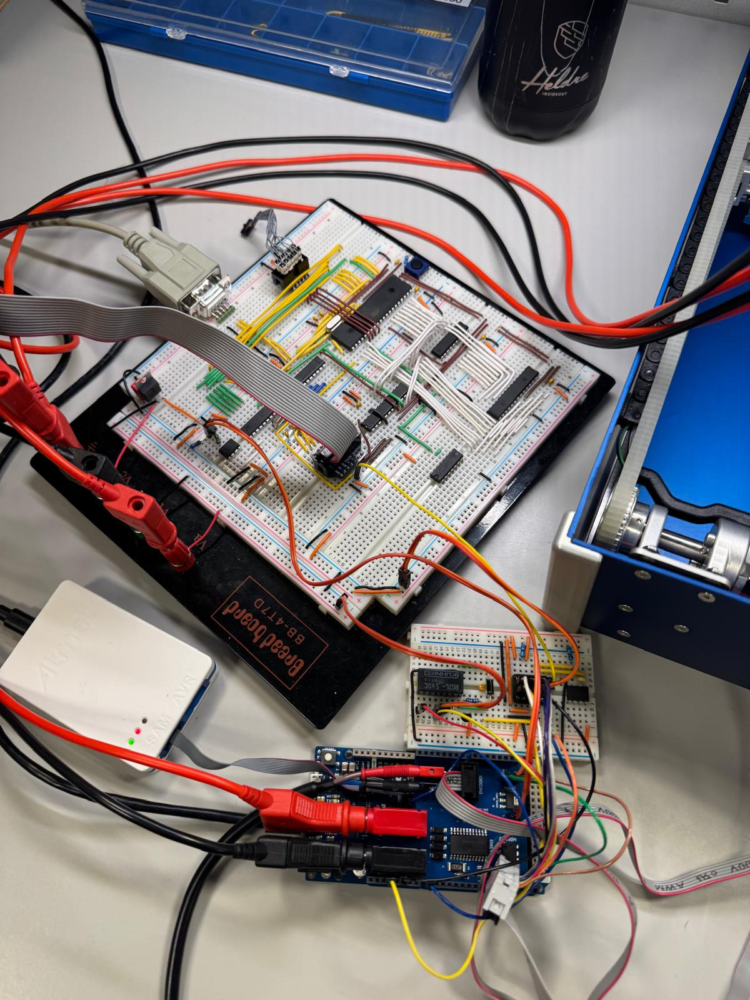

# Ping Pong Game – Distributed Embedded Control System

This repository contains the implementation of a **distributed embedded control system** developed as the term project for Embedded Software for the Internet of Things

The goal of the project is to design, implement, and integrate hardware and software components to realize a fully functional electromechanical ping-pong game.

---

## Project Overview

The system is built around two cooperating embedded nodes that communicate over a **CAN bus**.  


---

## System Architecture

### Node 1 – User Interface & Game Logic
- **Microcontroller**: ATmega162 (AVR)
- **Main responsibilities**:
  - Read user inputs (joystick, buttons, touch sensors)
  - Manage game logic and score
  - Drive the OLED display
  - Send control commands to Node 2 via CAN
- **Key peripherals**:
  - External SRAM via parallel memory interface
  - ADC (MAX156) for analog inputs
  - OLED display via SPI
  - CAN controller (MCP2515) via SPI
  - RS-232 interface for debugging





### Node 2 – Actuation & Control
- **Microcontroller**: ATSAM3X8E (ARM Cortex-M3, Arduino Due)
- **Main responsibilities**:
  - Servo control for paddle positioning
  - DC motor control with encoder feedback
  - Solenoid control for ball shooting
  - IR sensor processing for goal detection
- **Key peripherals**:
  - CAN transceiver (MCP2562)
  - Motor driver (A3959)
  - PWM module for servo and motor control
  - ADC for IR sensor input





---

## Communication

- **Protocol**: CAN (Controller Area Network)
- **Purpose**:
  - Transmit joystick positions and commands from Node 1 to Node 2
  - Transmit feedback and game events from Node 2 to Node 1
- **Design approach**:
  - Layered CAN driver
  - Hardware-independent message abstraction

---

## Software Structure

The codebase follows a **modular driver-based design**, where each hardware component has its own driver.

---

## Build and Flashing

### Node 1 – ATmega162
- **Toolchain**: avr-gcc, avr-libc, avrdude
- **Flashing command**:
```
make flash
```

### Node 2 – ATSAM3X8E
- **Toolchain**: gcc-arm-none-eabi
- **Debugging**: OpenOCD
- **Flashing command**:
```
make flash
```

## Development Notes

- Node 1 operates at **5V logic**, Node 2 at **3.3V logic**  
  → Level shifting is required.
- External memory, SPI, and CAN buses were verified using oscilloscope measurements.
- The project emphasizes:
  - Deterministic timing
  - Noise-robust hardware design
  - Clear software modularization

